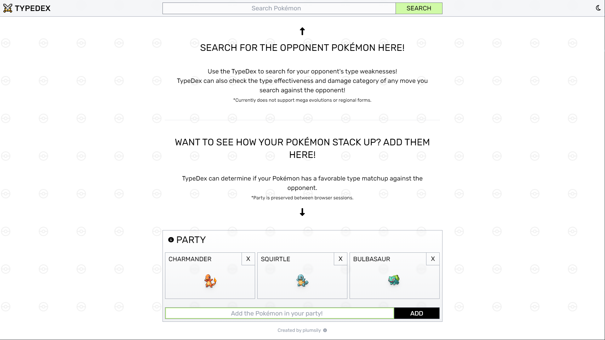
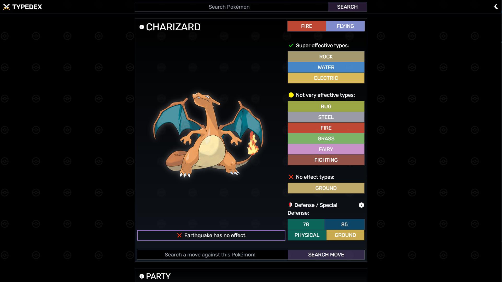

<!-- PROJECT LOGO -->
 

  <a href="https://plumsily.github.io/typedex/">⚔️
  </a>
<h3 align="center">TypeDex</h3>

  

    TypeDex serves to be a handy Pokémon battle companion that can instantly provide type weaknesses of any Pokémon that you encounter on your journey! TypeDex can also search any move against the selected Pokémon to check for effectiveness! 
     
     
    <a href="https://plumsily.github.io/typedex/"">View it live here!</a>
  

<!-- TABLE OF CONTENTS -->

  
Table of Contents

  <ol>
    <li>
      <a href="#about-the-project">About The Project</a>
      <ul>
        <li><a href="#built-with">Built with:</a></li>
      </ul>
    </li>
    <li><a href="#usage">Usage</a></li>
    <!-- <li><a href="#roadmap">Roadmap</a></li> -->
    <!-- <li><a href="#optimizations">Optimizations</a></li> -->
    <li><a href="#lessons-learned">Lessons Learned</a></li>
    <li><a href="#acknowledgements">Acknowledgements</a></li>
    <li><a href="#contact">Contact</a></li>
  </ol>

<!-- ABOUT THE PROJECT -->

## About The Project

TypeDex is an app inspired by the original PokéDex but with additional features related to Pokémon battling. No longer will you need to parse through an online wiki or cross reference type charts to find out if a move will be effective against a Pokémon. Features include:

- Super effective, not very effective, no effect types
- Defense and Special Defense stats displayed for damage typing
- Move checker
  - Effectiveness
  - Damage type (physical vs special)
- Integration with Bulbapedia for full information on selected Pokémon
- Dark mode
- Party members
  - Preserved between browser sessions with local storage
  - Dynamic matchup favorability against selected Pokémon
- Mobile version
- Alerts for misspelled or non-existant Pokémon

(<a href="#readme-top">back to top</a>)

### Built With

- React
- HTML
- CSS, Tailwind
- JavaScript

Built using React, TypeDex takes full advantage of functional components to dynamically adjust the UI for each search. TypeDex uses an API that serves all known type weaknesses for Pokémon. The same API provides information related to any move as well. The Defense / Special Defense UI for each Pokémon are proprotional to their base stat values. This allows the user to quickly see the strengths and weaknesses of the Pokémon relative to each other. Dark mode preferences and party members are saved via local storage.

(<a href="#readme-top">back to top</a>)

<!-- USAGE EXAMPLES -->

## Usage

If the Pokémon exists or is inputted correctly, TypeDex will serve the official artwork of the Pokémon as well as all of it's type matchings. Click the Pokémon's name to be redirected to Bulbapedia's wiki page for that Pokémon.

 

When a Pokémon is displayed, the option to search a move is provided below. If the move exists or is inputted correctly, TypeDex will check that move's type matching to the Pokémon if it is applicable. Additionally, the damage type will be displayed to indicate which defense stat the move will affect. (Special moves affect Special Defense vs. Physical moves affect Defense).

 

 

Pokémon can be entered into the party UI, which will be preserved between broswer sessions via local storage. The UI will dynamically update the matchup favorability, indicated via colored tiers, against searched Pokémon. This serves to quickly provide high-level typing information when choosing which Pokémon to send out.

 

 

 

Dark mode can be toggled via the moon button on the header. This mode is saved in your browser via localstorage.

 

Mobile layout is also supported via responsive design.

 

 

 

(<a href="#readme-top">back to top</a>)

<!-- Optimizations

## Optimizations

You don't have to include this section but interviewers *love* that you can not only deliver a final product that looks great but also functions efficiently. Did you write something then refactor it later and the result was 5x faster than the original implementation? Did you cache your assets? Things that you write in this section are **GREAT** to bring up in interviews and you can use this section as reference when studying for technical interviews! -->

<!-- ROADMAP

## Roadmap

- [x] 2022 race schedule info and track layout
  - [x] Background wallpaper shuffling
  - [x] Countdown for next upcoming race
  - [x] Automatic display of next upcoming race info
- [x] History bar to access past races of the season
  - [x] Shuffling button
    - [x] Active by default at end of season to cycle all races
- [ ] Chrome extension store approval
- [ ] 2023 race schedule assets for Firebase

See the [open issues](https://github.com/plumsily/f1-new-tab/issues) for a full list of proposed features (and known issues).

(<a href="#readme-top">back to top</a>)
 -->

## Lessons Learned:

This App was a great opportunity to incorporate localstorage to save dark mode preferences. Tailwind also makes it easy to integrate dark mode CSS classes. Using ternary operators inside styles was also a huge game-changer in dynamically changing the UI depending on JS variables or React states. Chaining API calls and updating React states before component rendering was a great lesson in managing state changes.

<!-- ACKNOWLEDGEMENTS -->

## Acknowledgements

<a href="https://pokeapi.co/">PokéAPI</a> for all Pokémon searches!

(<a href="#readme-top">back to top</a>)

<!-- CONTACT -->

## Contact

Justin Lee - [@plumsily](https://twitter.com/plumsily)

<!-- Take a look at these couple examples that I have in my own portfolio:

**F1 New Tab:** https://github.com/alecortega/f1-new-tab

**Sculptd:** https://github.com/alecortega/twitter-battle

**Patch Panel:** https://github.com/alecortega/patch-panel -->

(<a href="#readme-top">back to top</a>)

